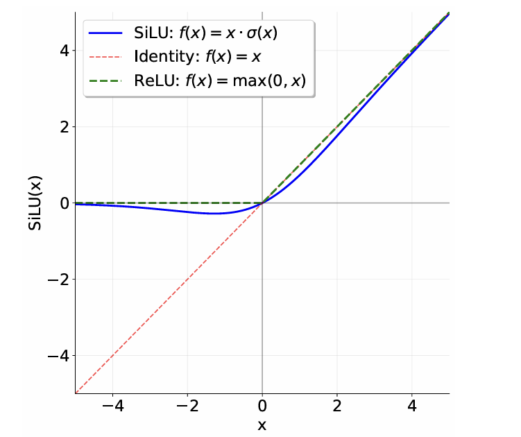
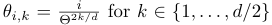
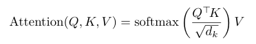
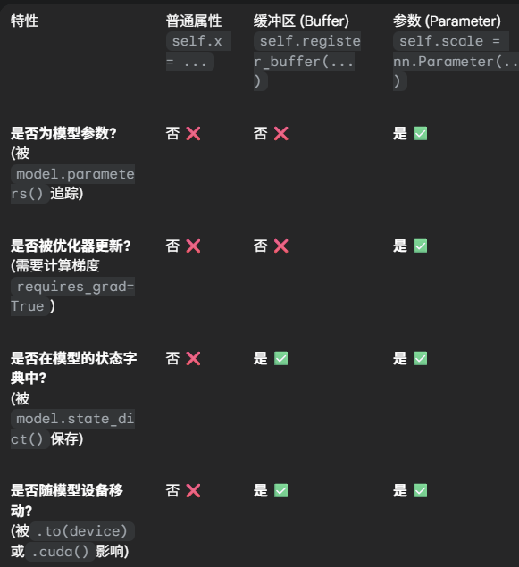

# Understanding Unicode

## unicode 1

1. `chr(0)`  returns '\x00'
2. String representation of '\x00' is "'\x00'", while its printed representation appears as an invisible, non-printing character.
3. 'this is a test\x00string' and this is a teststring

## unicode 2

1. The sequence of UTF-16 or UTF-32 code is longer than UTF-8
2. UTF-8 use 1-4 bytes to represent a character
3. `\xb0\x00` is a two-byte sequence that does not decode to any Unicode character in UTF-8, because the second byte must be in the range 0x80–0xBF (start with binary 10), but `\x00` does not satisfy this condition.

# BPE

1. Vocabulary Initialization
2. Pre-tokenization: ( 1. pre-tokenization can save time, avoid go over the corpus each time we merge. 2. avoid token generated by auto merging like `dog!` `dog.` , even though they have high semantic similarity

   1. 

   ```py
   >>> import regex as re
   >>> PAT = r"""'(?:[sdmt]|ll|ve|re)| ?\p{L}+| ?\p{N}+| ?[^\s\p{L}\p{N}]+|\s+(?!\S)|\s+"""
   >>> re.findall(PAT, "some text that i'll pre-tokenize")
   ['some', ' text', ' that', ' i', "'ll", ' pre', '-', 'tokenize']
   ```

3. Compute BPE merges

   1. Now the input text is converted to pre-tokens which represented by a sequence of UTF-8 bytes.
   2. preferring the lexicographically greater pair (if the pairs (“A”, “B”), (“A”, “C”), (“B”, “ZZ”),and (“BA”, “A”) all have the highest frequency, we’d merge (“BA”, “A”)

      ```py
      >>> max([("A", "B"), ("A", "C"), ("B", "ZZ"), ("BA", "A")])
      ('BA', 'A')
      ```


4. Special tokens

   1. Tokens like `<|endoftext|>` representing boundaries between documents should be treated as a single token and will never be merged.

5. 


# pytest

Pytest在测试通过时会默认不显示log，可以通过

`--log-cli-level` 来告诉控制台显示特定日志级别的消息

```bash
pytest tests/test_bpe_tokenizer.py::test_from_pretrained --log-cli-level=INFO
```


# Transformer

## Position-Wise Feed-Forward Network

**SwiGU**



$Sigmoid(x)=\sigma(x)=\frac{1}{1+e^{-x}}$

$SiLU=\frac{x}{1+e^{-x}}$, similar to ReLU, but is smooth at zero.

$GLU(x, W_1, W_2) = \sigma(W_1x)\odot W_2x$, a improved SiLU, amming to reduce the vanishing gradient problem for deep architectures by providing a linear path for the gradients, while retaining non-linear capabilities. SiLU has the same ability, but no **gate**.

**GLU is more flexiable**

$FFN(x)=SwiGLU(x, W_1, W_2, W_3)=W_2(SiLU(W_1x)\odot W_3 x)$


## Relative Positional Embeddings

For tokens at position $i$,

$$
R_k^i = \begin{bmatrix} \cos(\theta_{i,k}) & -\sin(\theta_{i,k}) \\ \sin(\theta_{i,k}) & \cos(\theta_{i,k}) \end{bmatrix}.
$$

$$
R^i = \begin{bmatrix}
R_1^i & 0 & 0 & \cdots & 0 \\
0 & R_2^i & 0 & \cdots & 0 \\
0 & 0 & R_3^i & \cdots & 0 \\
\vdots & \vdots & \vdots & \ddots & \vdots \\
0 & 0 & 0 & \cdots & R_{d/2}^i
\end{bmatrix},
$$

For a given query token $q^{(i)}=W_qx^{(i)}\in R^d$ at position $i$, $q'^{(i)}=R^iq^{(i)}=R^iW_qx^{(i)}$

$\theta_{i,k}=\frac{i}{\Theta^{2k/d}}$ for $k \in \{0, .., d/2-1\}$


There is a little bug in the assignment1 pdf,



The correct k is from 0 to d/2-1


## Attention

problem:



should be $softmax(\frac{Qk^T}{\sqrt{d_k}})V$


**MHA**

$Q_i, K_i, V_i$ being slice number $i \in \{1,...,h\}$ of size $d_k$ or $d_v$ of the embedding dimension for $Q, K$, and $V$respectively. 

$MultiHeadSelfAttention(x) = W_OMultiHead(W_Q x, W_K x, W_V x) $

# Torch

## self.register_buffer("my_buffter", torch.tensor([10.0, 11/0]))




## torch.max(x: Float[Tensor, "..."], dim=-1)

return

**max_value** and **max_value_index**

```python
x = torch.tensor([[1, 5], [8, 2]])
torch.max(x, dim=-1, keepdim=True)
```

return `(tensor([[5.], [8.]]), tensor([[1], [0]]))`