# Understanding Unicode336


## unicode 1

1. `chr(0)`  returns '\x00'
2. String representation of '\x00' is "'\x00'", while its printed representation appears as an invisible, non-printing character.
3. 'this is a test\x00string' and this is a teststring

## unicode 2

1. The sequence of UTF-16 or UTF-32 code is longer than UTF-8
2. UTF-8 use 1-4 bytes to represent a character
3. `\xb0\x00` is a two-byte sequence that does not decode to any Unicode character in UTF-8, because the second byte must be in the range 0x80–0xBF (start with binary 10), but `\x00` does not satisfy this condition.

# BPE

1. Vocabulary Initialization
2. Pre-tokenization: ( 1. pre-tokenization can save time, avoid go over the corpus each time we merge. 2. avoid token generated by auto merging like `dog!` `dog.` , even though they have high semantic similarity

   1. 

   ```py
   >>> import regex as re
   >>> PAT = r"""'(?:[sdmt]|ll|ve|re)| ?\p{L}+| ?\p{N}+| ?[^\s\p{L}\p{N}]+|\s+(?!\S)|\s+"""
   >>> re.findall(PAT, "some text that i'll pre-tokenize")
   ['some', ' text', ' that', ' i', "'ll", ' pre', '-', 'tokenize']
   ```

3. Compute BPE merges

   1. Now the input text is converted to pre-tokens which represented by a sequence of UTF-8 bytes.
   2. preferring the lexicographically greater pair (if the pairs (“A”, “B”), (“A”, “C”), (“B”, “ZZ”),and (“BA”, “A”) all have the highest frequency, we’d merge (“BA”, “A”)

      ```py
      >>> max([("A", "B"), ("A", "C"), ("B", "ZZ"), ("BA", "A")])
      ('BA', 'A')
      ```


4. Special tokens

   1. Tokens like `<|endoftext|>` representing boundaries between documents should be treated as a single token and will never be merged.

5. 


# Experiments with tokenizer

First select 10 articles randomly in each file.

```py
samples_tinystories = select_articles_from_file_corrected(tinystories_path, 10)
samples_owt = select_articles_from_file_corrected(owt_path, 10)
```

Then encodes the samples with Tokenizer trained in TinyStories and Tokenizer trained in Owt.

```py
tinystories_tiny_encoded = [tiny_tokenizer.encode(sample) for sample in samples_tinystories]
owt_tiny_encoded = [tiny_tokenizer.encode(sample) for sample in samples_owt]
tinystories_owt_encoded = [owt_tokenizer.encode(sample) for sample in samples_tinystories]
owt_owt_encoded = [owt_tokenizer.encode(sample) for sample in samples_owt]
```

```py
tinystories_sample_bytes = [sample.encode('utf-8') for sample in samples_tinystories]
owt_sample_bytes = [sample.encode('utf-8') for sample in samples_owt]
tiny_tiny_ratio = [len(sample) / len(encoded_sample) for sample, encoded_sample in zip(tinystories_sample_bytes, tinystories_tiny_encoded)]
owt_tiny_ratio = [len(sample) / len(encoded_sample) for sample, encoded_sample in zip(owt_sample_bytes, owt_tiny_encoded)]
tiny_owt_ratio = [len(sample) / len(encoded_sample) for sample, encoded_sample in zip(tinystories_sample_bytes, tinystories_owt_encoded)]
owt_owt_ratio = [len(sample) / len(encoded_sample) for sample, encoded_sample in zip(owt_sample_bytes, owt_owt_encoded)]
print(f"Tiny Stories compression ratio by Tiny Stories Tokenizer (bytes/token): {sum(tiny_tiny_ratio) / len(tiny_tiny_ratio)}")
print(f"OWT compression ratio by Tiny Stories Tokenizer (bytes/token): {sum(owt_tiny_ratio) / len(owt_tiny_ratio)}")
print(f"Tiny Stories compression ratio by OWT Tokenizer (bytes/token): {sum(tiny_owt_ratio) / len(tiny_owt_ratio)}")
print(f"OWT compression ratio by OWT Tokenizer (bytes/token): {sum(owt_owt_ratio) / len(owt_owt_ratio)}")
```

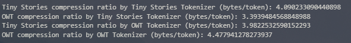

Tokenizer performs better on the training article.

Tokenizer trained on larger article performs better.

```py
sta_time = time.time()
sample_owt_tokenized = [owt_tokenizer.encode(sample) for sample in samples_owt]
end_time = time.time()
total_bytes = sum([len(sample.encode('utf-8')) for sample in samples_owt])
total_tokens = sum([len(encoded_sample) for encoded_sample in sample_owt_tokenized])
print(f"OWT Tokenization Time: {end_time - sta_time} seconds")
print(f"OWT Tokenization Compression Ratio (bytes/token): {total_bytes / total_tokens}")
print(f"bytes/second: {total_bytes / (end_time - sta_time)}")
print(f"tokens/second: {total_tokens / (end_time - sta_time)}")
```

Throughput of OwtTokenizer is around 7800 bytes/second.

Tokenizes a 825gb file would cost 31536h.

$$
825*1024*1024*1024/7800/60/60 \approx 31546
$$

Above is the throughput of tokenizer without buffer and using token_2_ids with low effiency

With high efficient token_2_ids and buffer.

```py
sta_time = time.time()
sample_owt_tokenized = [owt_tokenizer.encode(sample) for sample in samples_owt]
end_time = time.time()
total_bytes = sum([len(sample.encode('utf-8')) for sample in samples_owt])
total_tokens = sum([len(encoded_sample) for encoded_sample in sample_owt_tokenized])
print(f"OWT Tokenization Time: {end_time - sta_time} seconds")
print(f"OWT Tokenization Compression Ratio (bytes/token): {total_bytes / total_tokens}")
print(f"bytes/second: {total_bytes / (end_time - sta_time)}")
print(f"tokens/second: {total_tokens / (end_time - sta_time)}")
```

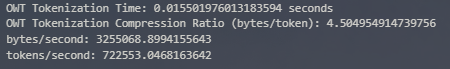

```py
sta_time = time.time()
sample_owt_tokenized = [tiny_tokenizer.encode(sample) for sample in samples_owt]
end_time = time.time()
total_bytes = sum([len(sample.encode('utf-8')) for sample in samples_owt])
total_tokens = sum([len(encoded_sample) for encoded_sample in sample_owt_tokenized])
print(f"OWT Tokenization Time: {end_time - sta_time} seconds")
print(f"OWT Tokenization Compression Ratio (bytes/token): {total_bytes / total_tokens}")
print(f"bytes/second: {total_bytes / (end_time - sta_time)}")
print(f"tokens/second: {total_tokens / (end_time - sta_time)}")
```

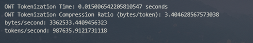

Throughput of OwtTokenizer is around 3360000 bytes/second.

Tokenizes a 825gb file would cost 73h.

$$
825*1024*1024*1024/3360000/60/60 \approx 73
$$


# pytest

Pytest在测试通过时会默认不显示log，可以通过

`--log-cli-level` 来告诉控制台显示特定日志级别的消息

```bash
pytest tests/test_bpe_tokenizer.py::test_from_pretrained --log-cli-level=INFO
```


# IO

## np.load("large_array.npy", mmap_mode="r")

```py
import numpy as np

# 假设您有一个非常大的 .npy 文件，例如 'large_array.npy'
# 使用 mmap_mode='r' (只读模式) 加载
# 这个操作非常快，无论文件有多大
mmap_array = np.load('large_array.npy', mmap_mode='r')

# 您可以像操作普通数组一样查看它的属性，而不会加载数据
print(f"数组形状 (Shape): {mmap_array.shape}")
print(f"数据类型 (Dtype): {mmap_array.dtype}")
print(f"数组总长度: {len(mmap_array)}")
```

```py
def sample_segments_from_mmap(mmap_array: np.ndarray, n: int, m: int) -> list[np.ndarray]:
    
    total_length = len(mmap_array)
    
    if total_length < m:
        raise ValueError("数组总长度 L 小于指定的段长度 m")
        
    # 随机生成n个有效的起始索引
    # 最大有效起始索引是 total_length - m
    max_start_index = total_length - m
    start_indices = np.random.randint(0, max_start_index + 1, size=n)
    
    # 使用列表推导式高效地提取所有数据段
    # 每次切片都只会从磁盘读取需要的数据
    samples = [mmap_array[i : i + m] for i in start_indices]
    
    return samples
```


# Transformer

## Position-Wise Feed-Forward Network

**SwiGU**


$Sigmoid(x)=\sigma(x)=\frac{1}{1+e^{-x}}$

$SiLU=\frac{x}{1+e^{-x}}$, similar to ReLU, but is smooth at zero.

$GLU(x, W_1, W_2) = \sigma(W_1x)\odot W_2x$, a improved SiLU, amming to reduce the vanishing gradient problem for deep architectures by providing a linear path for the gradients, while retaining non-linear capabilities. SiLU has the same ability, but no **gate**.

**GLU is more flexiable**

$FFN(x)=SwiGLU(x, W_1, W_2, W_3)=W_2(SiLU(W_1x)\odot W_3 x)$


## Relative Positional Embeddings

For tokens at position $i$,

$$
R_k^i = \begin{bmatrix} \cos(\theta_{i,k}) & -\sin(\theta_{i,k}) \\ \sin(\theta_{i,k}) & \cos(\theta_{i,k}) \end{bmatrix}.
$$

$$
R^i = \begin{bmatrix}
R_1^i & 0 & 0 & \cdots & 0 \\
0 & R_2^i & 0 & \cdots & 0 \\
0 & 0 & R_3^i & \cdots & 0 \\
\vdots & \vdots & \vdots & \ddots & \vdots \\
0 & 0 & 0 & \cdots & R_{d/2}^i
\end{bmatrix},
$$

For a given query token $q^{(i)}=W_qx^{(i)}\in R^d$ at position $i$, $q'^{(i)}=R^iq^{(i)}=R^iW_qx^{(i)}$

$\theta_{i,k}=\frac{i}{\Theta^{2k/d}}$ for $k \in \{0, .., d/2-1\}$


There is a little bug in the assignment1 pdf,


The correct k is from 0 to d/2-1


## Attention

problem:


should be $softmax(\frac{Qk^T}{\sqrt{d_k}})V$


**MHA**

$Q_i, K_i, V_i$ being slice number $i \in \{1,...,h\}$ of size $d_k$ or $d_v$ of the embedding dimension for $Q, K$, and $V$respectively.

$MultiHeadSelfAttention(x) = W_OMultiHead(W_Q x, W_K x, W_V x) $

# Torch

## self.register_buffer("my_buffter", torch.tensor([10.0, 11/0]))


## torch.max(x: Float[Tensor, "..."], dim=-1)

return

**max_value** and **max_value_index**

```python
x = torch.tensor([[1, 5], [8, 2]])
torch.max(x, dim=-1, keepdim=True)
```

return `(tensor([[5.], [8.]]), tensor([[1], [0]]))`


## Fancy Indexing

```py
import torch

# 原始张量
data = torch.tensor([[10, 20, 30],
                     [40, 50, 60],
                     [70, 80, 90]])

print("原始张量:\n", data)

# 示例 1: 使用一维索引张量
# 选取第0行和第2行
row_indices = torch.tensor([0, 2])
selected_rows = data[row_indices]
print("\n使用一维行索引:\n", selected_rows)
# 结果形状是 (2, 3)，因为我们选择了2行，每行3列

# 示例 2: 使用二维索引张量
# 选取 (0,0), (1,1), (2,2) 处的元素 (对角线)
# 注意：当提供多个维度上的索引张量时，它们会“配对”
row_indices_diag = torch.tensor([0, 1, 2])
col_indices_diag = torch.tensor([0, 1, 2])
selected_diag = data[row_indices_diag, col_indices_diag]
print("\n选取对角线元素:\n", selected_diag)
# 结果形状是 (3,)，因为我们指定了3个具体的 (row, col) 对

# 示例 3: 广播行为 (复杂但强大)
# 选取 (0,0), (0,1), (1,0), (1,1)
# 想象一下：
# row_indices_broadcast = [[0], [1]] -> 广播成 [[0,0],[1,1]]
# col_indices_broadcast = [[0,1]]   -> 广播成 [[0,1],[0,1]]
row_indices_broadcast = torch.tensor([[0], [1]])
col_indices_broadcast = torch.tensor([0, 1])
selected_broadcast = data[row_indices_broadcast, col_indices_broadcast]
print("\n使用广播索引:\n", selected_broadcast)
# 结果形状是 (2, 2)
```


## torch.gather()

从每个切片，每个行/列中根据索引挑选一个元素

必须指定一个`dim`，表示要进行收集操作的维度

`index` Tensor形状必须与 `input` Tensor的形状相同，`index` Tensor的形状必须是`input` Tensor在除`dim`以外的所有维度上的形状，`dim`维度上的大小可以是任意的，因为表示在这维度上要`收集`多少个元素

```py
import torch

# 原始张量
data = torch.tensor([[10, 20, 30],
                     [40, 50, 60],
                     [70, 80, 90]])

print("原始张量:\n", data)

# 示例 1: 沿着 dim=0 (行) 收集
# 对于每一列，我们根据索引选择一个行元素
# index 的形状必须和 data 相同，除了 dim=0 维度
indices_dim0 = torch.tensor([[0, 0, 0],  # 对于第0列，取data[0,0]
                             [1, 1, 1],  # 对于第1列，取data[1,1]
                             [2, 2, 2]]) # 对于第2列，取data[2,2]
# 在 dim=0 维度上，index[row, col] 表示在 data 的 col 列中，选择第 index[row, col] 行的元素
gathered_dim0 = torch.gather(data, dim=0, index=indices_dim0)
print("\n沿着 dim=0 收集:\n", gathered_dim0)
# 结果: [[10, 20, 30], [40, 50, 60], [70, 80, 90]] (这里刚好和原始张量一样，因为索引是 0,1,2 顺着取的)

# 让我们换一个索引看看 dim=0 的效果
indices_dim0_v2 = torch.tensor([[2, 1, 0], # 第0列取data[2,0], 第1列取data[1,1], 第2列取data[0,2]
                                [1, 0, 2]])# 第0列取data[1,0], 第1列取data[0,1], 第2列取data[2,2]
gathered_dim0_v2 = torch.gather(data, dim=0, index=indices_dim0_v2)
print("\n沿着 dim=0 收集 (V2):\n", gathered_dim0_v2)
# 结果形状是 (2, 3)，因为 indices_dim0_v2 是 (2,3)
# output[0,0] = data[indices_dim0_v2[0,0], 0] = data[2,0] = 70
# output[0,1] = data[indices_dim0_v2[0,1], 1] = data[1,1] = 50
# output[0,2] = data[indices_dim0_v2[0,2], 2] = data[0,2] = 30
# output[1,0] = data[indices_dim0_v2[1,0], 0] = data[1,0] = 40
# output[1,1] = data[indices_dim0_v2[1,1], 1] = data[0,1] = 20
# output[1,2] = data[indices_dim0_v2[1,2], 2] = data[2,2] = 90

# 示例 2: 沿着 dim=1 (列) 收集
# 对于每一行，我们根据索引选择一个列元素
# index 的形状必须和 data 相同，除了 dim=1 维度
indices_dim1 = torch.tensor([[0, 2, 1],  # 对于第0行，取 data[0,0], data[0,2], data[0,1]
                             [1, 0, 0],  # 对于第1行，取 data[1,1], data[1,0], data[1,0]
                             [2, 1, 0]]) # 对于第2行，取 data[2,2], data[2,1], data[2,0]
gathered_dim1 = torch.gather(data, dim=1, index=indices_dim1)
print("\n沿着 dim=1 收集:\n", gathered_dim1)
# output[0,0] = data[0, indices_dim1[0,0]] = data[0,0] = 10
# output[0,1] = data[0, indices_dim1[0,1]] = data[0,2] = 30
# output[0,2] = data[0, indices_dim1[0,2]] = data[0,1] = 20
# output[1,0] = data[1, indices_dim1[1,0]] = data[1,1] = 50
# ...以此类推
```


## torch.optim.Optimizer

**`torch.optim.Optimizer`** **torch.optim.Optimizer** **torch.optim.Optimizer** **torch.optim.Optimizer** **torch.optim.Optimizer** **torch.optim.Optimizer** **torch.optim.Optimizer** **torch.optim.Optimizer** **torch.optim.Optimizer 基类的** **`__init__`** **__init__** **init** **init** **init** **init** **init** **init** **init** **方法承担着以下几个关键职责：**

a. **参数的注册与管理：** `Optimizer` 基类会接收 `params`，并将其内部组织成**参数组 (********`param_groups`** **param_groups** **param_groups** **param_groups** **param_groups** **param_groups** **param_groups** **param_groups** **param_groups)**。每个参数组是一个字典，其中包含： * `'params'`: 一个列表，存储属于该组的所有参数 `Tensor`。 * 以及该组特有的超参数，如 `'lr'` (学习率)、`'momentum'` (动量)、`'weight_decay'` (权重衰减) 等。

b. **处理多种参数输入格式：** 用户传递给优化器的 `params` 可以是以下几种形式： * 一个 `Iterable` 的 `torch.Tensor` 对象（例如 `model.parameters()`）。 * 一个 `dict`，代表一个参数组（例如 `{'params': model.parameters(), 'lr': 0.01}`）。 * 一个 `list`，其中包含多个 `dict`，每个字典代表一个参数组（例如 `[{'params': param1, 'lr': 0.01}, {'params': param2, 'lr': 0.001}]`）。 `Optimizer` 基类的 `__init__` 会智能地解析这些不同格式的 `params`，并统一地存储在 `self.param_groups` 列表中。

c. **设置默认超参数：** `Optimizer` 基类还会将 `defaults` 字典中的超参数（例如我们这里传入的 `lr`）与每个参数组进行关联。如果某个参数组没有明确指定某个超参数（例如没有指定自己的 `lr`），它就会使用 `defaults` 中定义的值。

- **收集** **`defaults`** **defaults** **defaults** **defaults** **defaults** **defaults** **defaults** **defaults** **defaults：** 当您调用 `super().__init__(params, defaults)` 时，`Optimizer` 基类首先会接收您在子类 `__init__` 中定义的 `defaults` 字典（例如，在自定义 `SGD` 中，`defaults = {"lr": lr}`）。这个 `defaults` 字典包含了**整个优化器实例的全局默认超参数值**。
- **构建** **`param_groups`** **param_groups** **param_groups** **param_groups** **param_groups** **param_groups** **param_groups** **param_groups** **param_groups：** 然后，基类会遍历您传入的 `params` 参数。

  - **如果** **`params`** **params** **params** **params** **params** **params** **params** **params** **params 是一个简单的可迭代对象（如** **`model.parameters()`** **model.parameters()** **model.parameters()** **model.parameters()** **model.parameters()** **model.parameters()** **model.parameters()** **model.parameters()** **model.parameters()）：** `Optimizer` 会创建一个**唯一的参数组**。这个参数组的字典会包含 `'params'` 键（值为所有模型的参数），然后将 `defaults` 字典中的所有键值对**复制**到这个参数组字典中。 例如，`optimizer1` 的 `self.param_groups` 将会是 `[{'params': [...], 'lr': 0.01, 'momentum': 0.9}]`。
  - **如果** **`params`** **params** **params** **params** **params** **params** **params** **params** **params 是一个包含多个字典的列表（即您手动定义了参数组）：** `Optimizer` 会遍历这个列表中的每个字典（即每个自定义参数组）。

    - 对于**每个自定义参数组**，基类会将其作为元素添加到 `self.param_groups` 列表中。
    - 更重要的是，对于每个参数组，基类会检查它**是否显式地定义了某些超参数**（例如 `'lr'`, `'weight_decay'`, `'momentum'` 等）。
    - **如果一个超参数在参数组中被显式定义，那么该参数组将使用它自己的特定值。**
    - **如果一个超参数在参数组中没有被显式定义，那么它将从之前传入** **`super().__init__`** **super().__init__** **super().****init** **super().****init** **super().****init** **super().****init** **super().****init** **super().init** **super().****init** **的** **`defaults`** **defaults** **defaults** **defaults** **defaults** **defaults** **字典中继承其值。**


```py
optimizer = torch.optim.Adam(model.parameters(), lr=0.001)
```

优化器内部的字典

```py
[
    {
        'params': [param1, param2, param3, ...], # 所有模型参数的列表
        'lr': 0.001,
        'betas': (0.9, 0.999),
        'eps': 1e-08,
        'weight_decay': 0,
        # ...其他 Adam 特有的超参数
    }
]
```

**self.state**

用于存储`nn.Parameter`对应的，在优化过程中产生的状态信息，Adam中存储了一阶矩`exp_avg`和二阶矩`exp_avg_sq`。在梯度更新时动态产生，每个参数独有。

# Resource counting

The vast majority of FLOPS in a Transformer are matrix multiplies.

Given $A \in R^{m \times n}$ and $B \in R^{n \times p}$, the matrix-matrix product $AB$rires $2mnp$FLOPS.

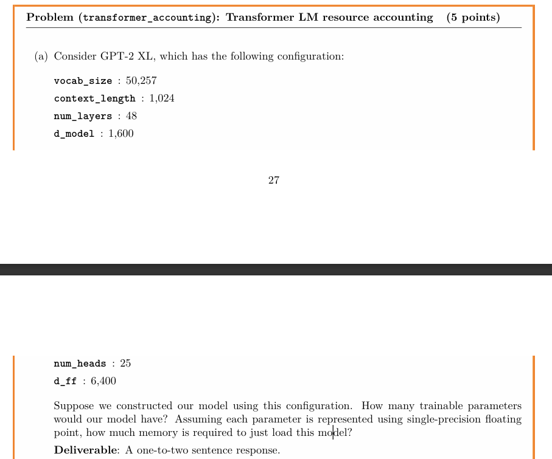


**Answer**

A Transfomer_LM contains:

one token_embeddings layer, num_layers Transformer_blocks, one ln_final, one lm_head, one rope, one mask

The parameters of embedding layer:

$$
vocab\_size \times d\_model
$$

Transformer_blocks:

````
MultiHeadAttention
````

$$
4 \times d\_model \times d\_model
$$

````
RMSNorm:
````

$$
2\times d\_model
$$

````
FeedForward:
````

$$
3\times d\_model \times d\_ff
$$

Ln_final:

$$
d\_model
$$

Lm_head:

$$
d\_model \times vocab\_size
$$

Rope:

$$
context\_length \times d\_model
$$

Mask:

$$
context\_length \times context\_length
$$

Total:

50257×1600 + 48 (4×1600×1600 + 2×1600 + 3×1600×6400) + 1600 + 1600×50257 + 1024×1600 + 1024×1024

= 2.129744576 × 10^9

2129744576×32=6.8151826432 × 10^10 bits

8.31931475 × 10^6 kb

7.9339168071746826171875 GB


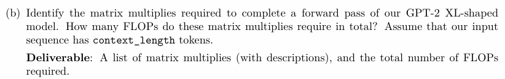

Matrix multiplies:

TransformerBlocks, lm_head, rope( 分块计算量很小，相对可以忽略

TransformerBlocks:

````
MultiHeadAttention.adf
````

$$
3\times 2\times context\_length \times d\_model  \times d\_model + \\ 
4 \times context\_length \times context\_length * d\_model
$$

````
FeedForward:
````

$$
6 \times context\_length \times d\_model \times d\_ff
$$

Lm_head:

$$
2 \times context\_length \times d\_model \times vocab\_size
$$

Total:

48*(6*1024*1600*1600+4*1024*1024*1600+6*1024*6400*1600)+2*1024*1600*1600= 4.1022390272 × 10^12 FLOPs


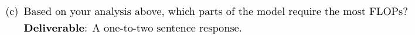

1st FFN

2nd Attn

When context_length is more less than d_ff, FFN would dominates. On the contrary, Attn would dominate.

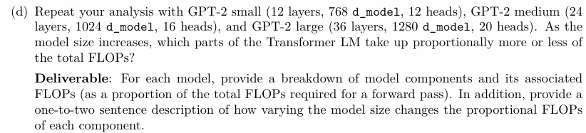

Attn:

````
proj
````

$$
6\times context\_length \times d\_model \times d\_model
$$

````
attn
````

$$
4 \times context\_length \times context\_length \times d\_model
$$

FFN:

$$
6 \times context\_length \times d\_model \times d\_ff
$$

Lm_head:

$$
2 \times context\_length \times d\_model \times vocab\_size
$$


**GPT-2**  small:

Attn: 12 layers

````
proj: 1.572864 × 10^10       15.9%

attn: 6.7108864 × 10^9      6.8%
````

FFN:  12 layers 6.291456 × 10^10   63.5%

Lm_head: 1.646821376 × 10^11     13.9%

Total: 1188931174400


**GPT-2** large:

Attn: 36 layers

````
proj: 566231040000   17.5%

attn:241591910400    7.5%
````

FFN: 36 layers  2264924160000  70.0%

Lm_head: 164682137600  5.1%

Total:  36*(6*1024*1600*1600+4*1024*1024*1600+6*1024*1600*6400)+2*1024*1600*50257 =3.237429248 × 10^12

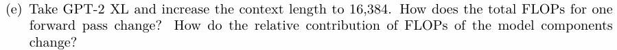

**GPT-2**  XL:

Attn: 48 layers

proj: 1.207959552 × 10^13   8.3%

attn: 8.24633720832 × 10^13   56.7%

FFN: 48 layers 4.831838208 × 10^13   33.2%

Lm_head: 2.6349142016 × 10^12    1.8%

Total: 48*(6*16384*1600*1600+4*16384*16384*1600+6*16384*1600*6400)+2*16384*1600*50257 =1.454962638848 × 10^14


# Traning a Transformer LM

Cross-entropy Loss

$$
\ell(\theta; D) = \frac{1}{|D|m} \sum_{x \in D} \sum_{i=1}^{m} -\log p_0(x_{i+1} \mid x_{1:i})
$$

logits to prob:

$$
p(x_{i+1} \mid x_{1:i}) = \text{softmax}(o_i)[x_{i+1}] = \frac{\exp(o_i[x_{i+1}])}{\sum_{a=1}^{\text{vocab\_size}} \exp(o_i[a])}
$$

**Perplexity**:

$$
\text{perplexity} = \exp \left( \frac{1}{m} \sum_{i=1}^{m} \ell_i \right)
$$


# SGD Optimizer

subclass the `torch.optim.Optimizer`. An Optimzier subclass must implement two methods

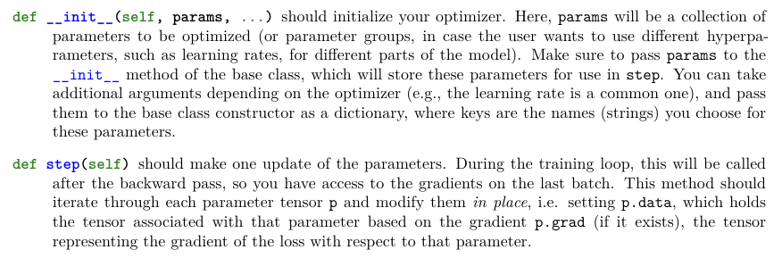

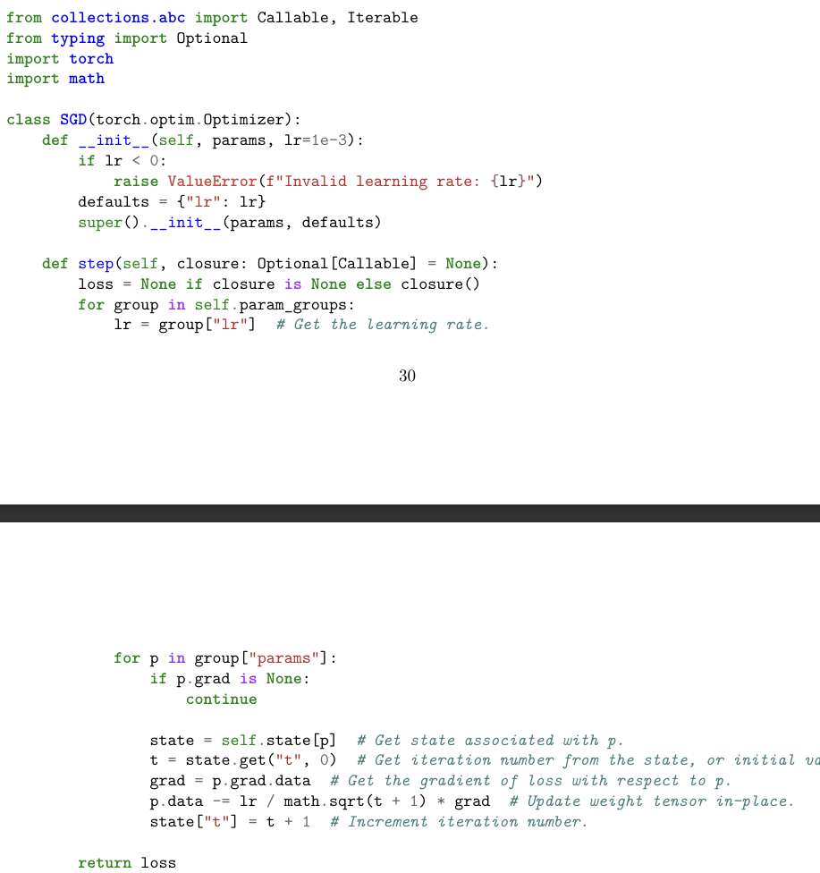


## Problem Tuning the learning rate

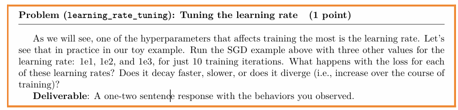

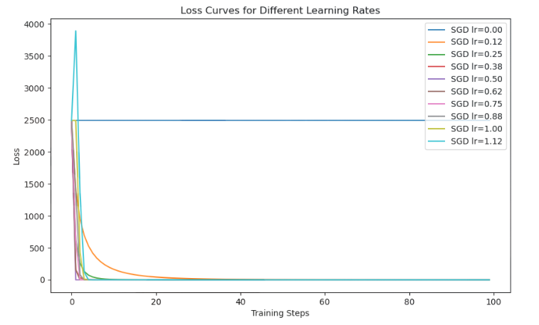

Although the larger the learning rate, the faster the loss decreases, but too large will lead to instability


# AdamW

AdamW is stateful:

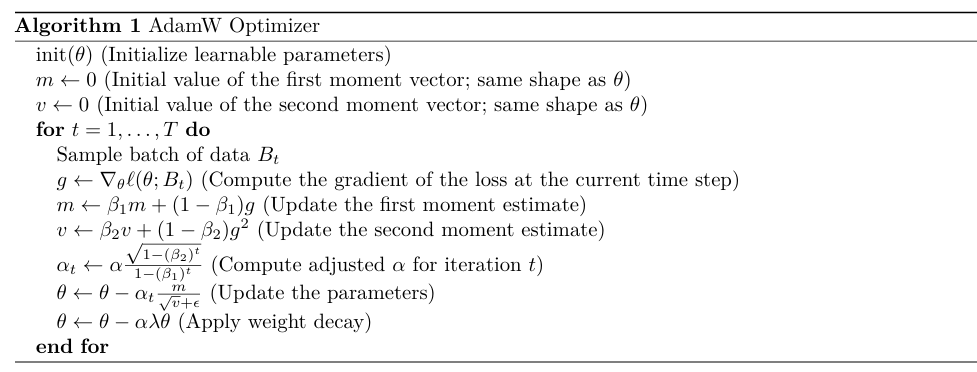


## Resource accounting for training with AdamW

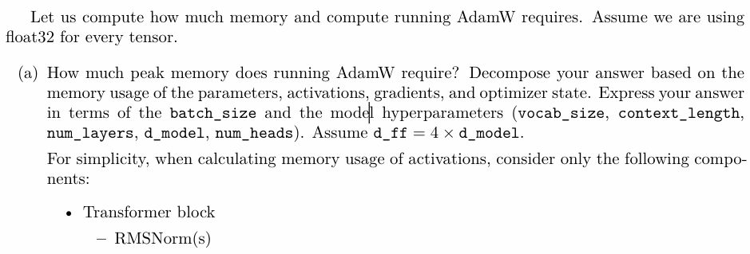

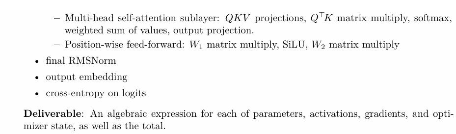

Memory:

````
parameters: 
````

$$
2vocab*d+L(4d^2+2d+3d*d\_ff)+d+c^2+cd
$$

````
activation:
````

$$
6*cd+c^2+2d*d_ff+c*d+c*vocab
$$

````
gradient:
````

$$
equals\ to\ parameter
$$

````
optimizer state:
````

$$
2*parameter
$$

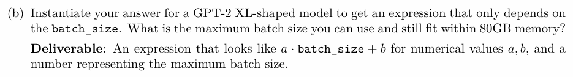

For GPT-2 XL:

$$
4*(2*50257*1600+48*(4*1600*1600+2*1600+3*1600*6400)+1600+1024*1024+1024*1600)+6*1024*1600+1024*1024+2*1024*6400+1024*1600+1024*50257
$$

Grad, parameter, optimizer states don't relate to batch_size

8.518978304 × 10^9 * 32 bits = 31.7356549203395843505859375GB


batch_size related memory:

7.7087744 × 10^7 * 32 bits = 0.287174224853515625GB


The max size of one batch, traning with one 80GB GPU:

48.63/0.287 = 169


# Learning rate scheduling

## cosine annealing learning rate

1. current iteration $t$
2. maximum learning rate $\alpha_{max}$
3. minimum learning rate $\alpha_{min}$
4. number of $warm-up$ iterations $T_w$
5. number of cosine annealing iterations $T_c$

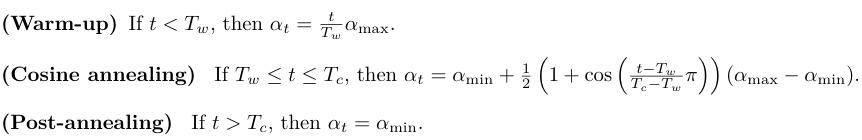


# Gradient_clipping

The gradient for all parameters $g$, compute the $l_2-norm$. If this norm is less than a maximum value $M$, then leave $g$ as is; otherwise, scale $g$ down by a factor $\frac{M}{||g||_2+\epsilon}$, $\epsilon = 10^{-6}$