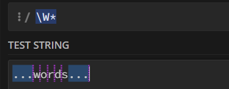
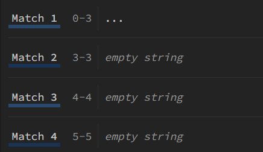

# Regex

## Zero-width match

A **zero-width match** matches a *position* where some condition is true, but does not actually capture any characters. Typical zero-width assertions are:

* `^` (start of string)
* `$` (end of string)
* `\b` (word boundary)
* `(?=...)` (lookahead)
* `(?!...)` (negative lookahead)

---

## `re.finditer()`

* Returns an iterator of `re.Match` objects, one for each match in the string.

**Example:**

```python
import re
pattern = r'\d+'  # Match one or more digits
s = "abc123def456ghi789"
matches = re.finditer(pattern, s)
for match in matches:
    print(match)         # Match object
    print(match.group()) # Matched substring
    print(match.start()) # Start position
    print(match.end())   # End position
```

**Output:**

```
<re.Match object; span=(3, 6), match='123'>
123
3
6
<re.Match object; span=(9, 12), match='456'>
456
9
12
<re.Match object; span=(15, 18), match='789'>
789
15
18
```

---

**Zero-width match example:**

```python
import re
s = "hi! bye."
matches = list(re.finditer(r'\b', s))
for m in matches:
    print(m.start(), m.group())
```

**Output:**

```
0
2
4
7
```

* For zero-width matches, `start()` returns the position ("gap") between characters, not an actual character index.
* For a *regular* match, `start()` gives the index of the first character in the matched substring.
* For a *zero-width* match, `start()` gives the "split point" between characters where the assertion holds.

---

## `re.split()`

* Splits a string wherever the pattern matches.
* If a match is at the beginning/end, you get empty strings in the result.
* Zero-width matches act as split points between characters.
* If a separator matches real characters, it consumes those characters; if not, it splits at the zero-width point.



**Result:**



For example, with zero-width matches:

```
['', '', 'w', 'o', 'r', 'd', 's', '', '']
```

For a pattern matching non-word characters:

```python
re.split(r'(\W*)', '...words...')
['', '...', '', '', 'w', '', 'o', '', 'r', '', 'd', '', 's', '...', '', '', '']
```

---

# Multiprocessing

## Use `fork()` to create a subprocess

```python
import os
print(f'Process {os.getpid()}')
pid = os.fork()  # Duplicates current process
if pid == 0:
    print('I am child process (%s) and my parent is %s.' % (os.getpid(), os.getppid()))
else:
    print('I (%s) just created a child process (%s).' % (os.getpid(), pid))
```

---

## Use `Process` from `multiprocessing` to create a subprocess

```python
from multiprocessing import Process
import os

def run_proc(name):
    print('Run child process %s (%s)...' % (name, os.getpid()))

if __name__=='__main__':
    print('Parent process %s.' % os.getpid())
    p = Process(target=run_proc, args=('test',))
    print('Child process will start.')
    p.start()
    p.join()  # Wait for child to finish
    print('Child process end.')
```

---

## Use `Pool` to manage a batch of subprocesses

```python
from multiprocessing import Pool
import os, time, random

def long_time_task(name):
    print('Run task %s (%s)...' % (name, os.getpid()))
    start = time.time()
    time.sleep(1)
    end = time.time()
    print('Task %s runs %0.2f seconds.' % (name, (end - start)))

if __name__=='__main__':
    print('Parent process %s.' % os.getpid())
    p = Pool(16)
    start = time.time()
    for i in range(16):
        p.apply_async(long_time_task, args=(i,))
    print('Waiting for all subprocesses done...')
    p.close()  # No more new tasks
    p.join()   # Wait for all to finish
    end = time.time()
    print(f'All subprocesses done. time:{end - start}')
```

---

## Use `Queue` to share data between processes

```python
def write(q):
    print('Process to write: %s' % os.getpid())
    for value in ['A', 'B', 'C']:
        print('Put %s to queue...' % value)
        q.put(value)
        time.sleep(random.random())

def read(q):
    print('Process to read: %s' % os.getpid())
    while True:
        value = q.get(True)
        print('Get %s from queue.' % value)

q = Queue()
pw = Process(target=write, args=(q,))
pr = Process(target=read, args=(q,))
pw.start()
pr.start()
pw.join()
pr.terminate()
```

---

# Notes on Variables and Memory in Multiprocessing

1. **Passing variables and instances**

   * Multiprocessing does *not* share memory (unlike threads). Each process has its own independent memory space.
   * Any parameters or objects you pass (including instances/methods/attributes) are **pickled and copied** for the child process.
   * If you pass an instance method, the *whole instance* is pickled and sent.
   * If you only pass function arguments, only those are pickled.

2. **Copies and Read-Only**

   * Variables/instances/attributes in a child are just *copies*. They are not kept in sync with the parent or other children.
   * The child can read them, but cannot update them for the parent.

3. **fork vs. spawn (Platform differences)**

   * **Linux fork:** The child inherits the parent’s memory (copy-on-write). At first, the child can "see" everything the parent had, but changes are not shared back.
   * **Windows/macOS spawn:** The child launches a new interpreter and re-imports the main module. The child only receives what you *explicitly* pass (by pickling); it cannot see all parent memory directly.

4. **True sharing between processes:**

   * Use `multiprocessing.Manager()`, `Value`, or `Array` to share data for real.
