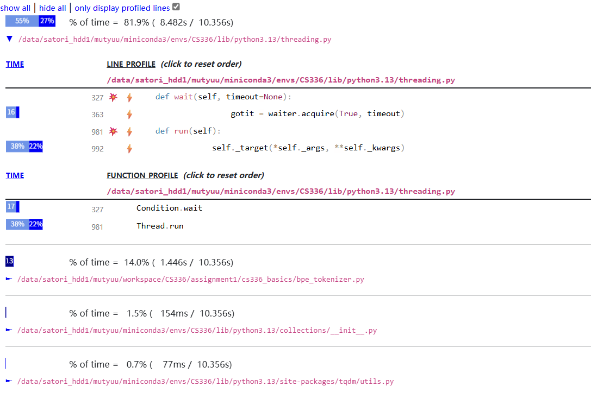
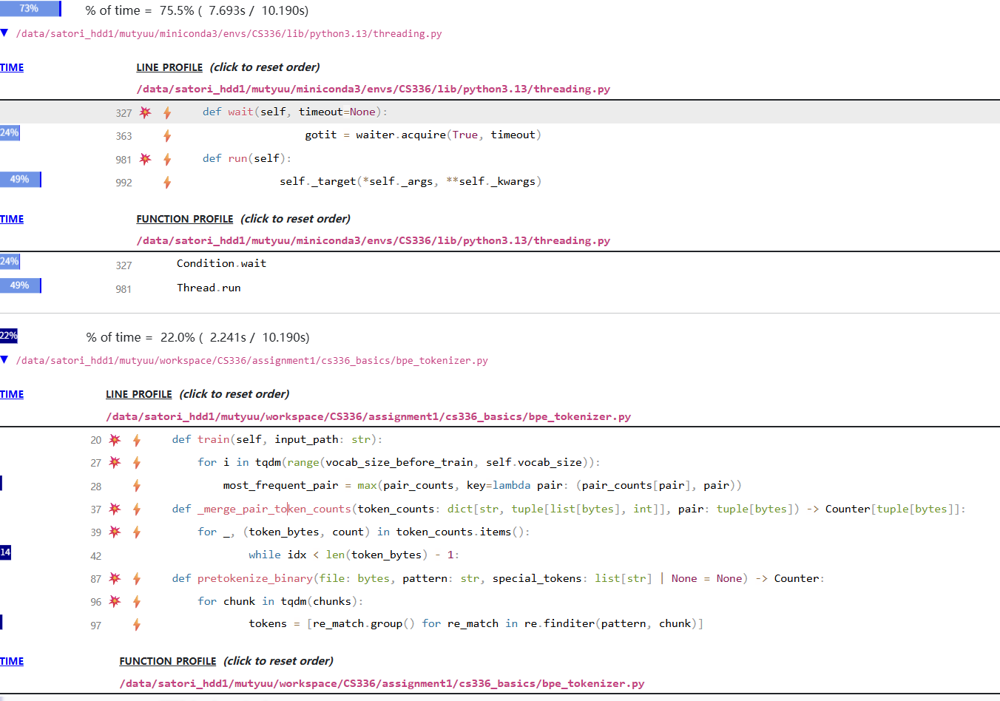
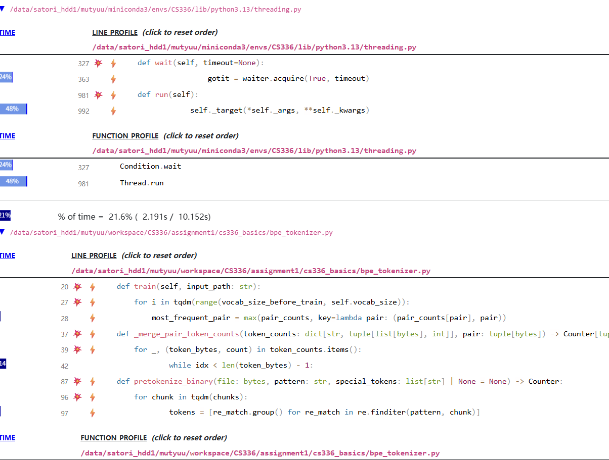
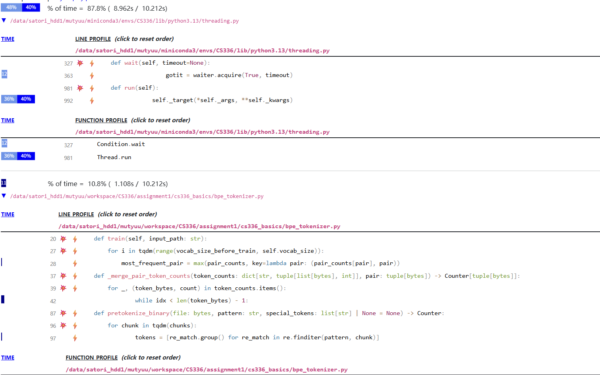
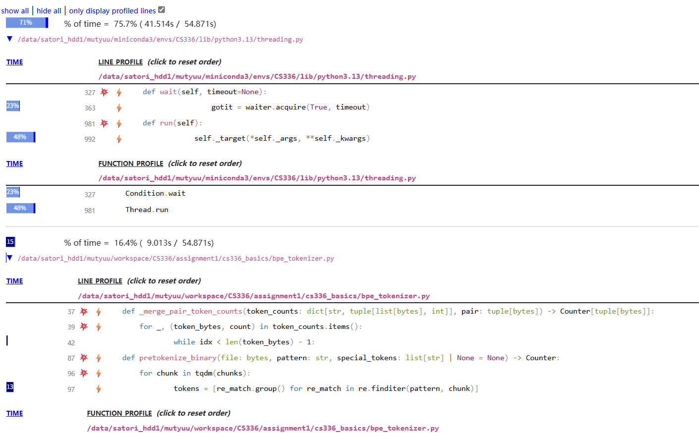
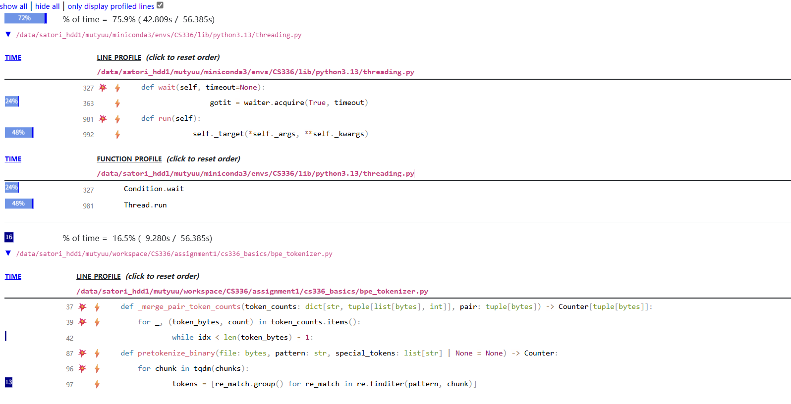

# Efficiency Analysis

## Cpu time consuming:

## TinyStories_valid.txt, multiprocess = 64, num_chunks = 256, vocab_size = 2000

python: 14%

native: 55%

system: 29%

## TinyStories_valid.txt, multiprocess=16, num_chunks=16,vocab_size=2000

python: 23

native: 73

system: 2.9

## TinyStories_valid.txt, multiprocess=16, num_chunks=256,vocab_size=2000

## TinyStories_valid.txt, multiprocess=64, num_chunks=16,vocab_size=2000

python: 11

native: 48

system: 40

进程并不是越多越好，太多的进程会增加 同步，数据通信，线程管理 的时间，从16进程加到64进程会发现system time上升一大截。这表示多进程管理消耗了非常多时间。

### TinyStories_train.txt, multiprocess = 64, num_chunks = 64, vocab_size = 2000

python: 23%

native: 72%

system: 4.7%

### TinyStories_train.txt, multiprocess = 64, num_chunks = 256, vocab_size = 2000

python: 23%

native: 72%

system: 4.7%

