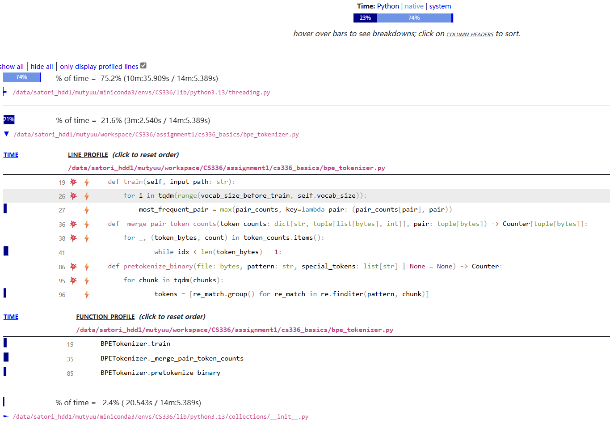

# Efficiency Analysis

## Cpu time consuming:

## TinyStories_valid.txt, multiprocess = 64, num_chunks = 256, vocab_size = 2000

python: 14%

native: 55%

system: 29%

## TinyStories_valid.txt, multiprocess=16, num_chunks=16,vocab_size=2000

python: 23

native: 73

system: 2.9

## TinyStories_valid.txt, multiprocess=16, num_chunks=256,vocab_size=2000

## TinyStories_valid.txt, multiprocess=64, num_chunks=16,vocab_size=2000

python: 11

native: 48

system: 40

## TinyStories_train.txt, multiprocess = 64, num_chunks = 64, vocab_size = 32000

python: 23%

native: 72%

system: 4.7%

## TinyStories_train.txt, multiprocess = 64, num_chunks = 256, vocab_size = 32000

python: 23%

native: 72%

system: 4.7%

